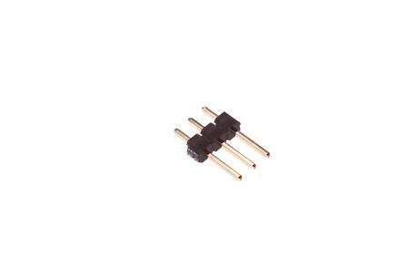
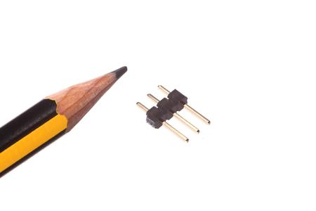

Contents
========

* [HEAD-I01-X-PI03-01>2.54 mm 3 Pin Header](#head-i01-x-pi03-01254-mm-3-pin-header)
	* [Images](#images)
	* [Images](#images)
	* [Tags](#tags)
  
![][im]
# HEAD-I01-X-PI03-01>2.54 mm 3 Pin Header

- ID: HEAD-I01-X-PI03-01
- Name: HEAD-I01-X-PI03-01

## Images
  
  

|Main|Reference|
| :---: | :---: |
|||

## Images
  
  

|Main|Reference|
| :---: | :---: |
|||

## Tags

- index: 4
- oompType: HEAD
- oompSize: I01
- oompColor: X
- oompDesc: PI03
- oompIndex: 01
- hexID: H03
- oompSort: 
- oompClass: Through Hole
- oompClassCode: THTH
- ooPitch: 2.54
- ooPinHeight: 11.60
- ooPinWidth: 0.64
- ooPinOffset: 1.53
- oompBbls: variable;pins;3
- oompBbls: template;XXXX-I01-X-XX-01-bbls
- oompDiag: variable;pins;3
- oompDiag: template;HEAD-I01-X-XX-01-diag
- oompIden: variable;pins;3
- oompIden: template;XXXX-I01-X-XX-01-iden
- oompSchem: variable;pins;3
- oompSchem: template;XXXX-XX-X-XX-01-PINS-ODD-schem
- oompSimp: variable;pins;3
- oompSimp: template;XXXX-I01-X-XX-01-simp
- ooNumPins: 3
- ooFootprint: OOMP-HEAD-I01-X-PI03-01
- ooDesignator: J1
- schematicSymbol: HEAD-XX-X-PI03-XX
- pcbFootprint: HEAD-I01-X-PI03-01
- kicadSymbol: Connector>Conn_01x03_Male
- kicadFootprint: Connector_PinHeader_2.54mm:PinHeader_1x03_P2.54mm_Vertical

[im]: image_600.jpg
