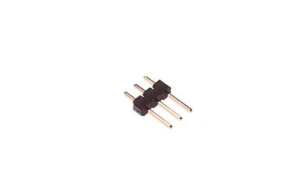

# HEAD-I01-X-PI03-01 > 2.54 mm 3 Pin Header  
  
index : 8961  
oompType : HEAD  
oompSize : I01  
oompColor : X  
oompDesc : PI03  
oompIndex : 01  
hexID : H03  
oompSort :   
oompClass : Through Hole  
oompClassCode : THTH  
ooPitch : 2.54  
ooPinHeight : 11.60  
ooPinWidth : 0.64  
ooPinOffset : 1.53  
ooNumPins : 3  
ooFootprint : OOMP-HEAD-I01-X-PI03-01  
oompTagCC manufacturer
YxconC-YXCOP125-1103A1BS116A1oompTagCC opl
SEEED OPLC-SEEEDIP Black Male Header VERT3200200791X3P-2.54-2.54-11.6/3.01X3P-2.54-2.54-11.6/3.0https://www.seeedstudio.com/opl.htmloompBbls : variable;clear  
oompBbls : variable;pins;3  
oompBbls : template;XXXX-I01-X-XX-01-bbls  
oompDiag : variable;clear  
oompDiag : variable;pins;3  
oompDiag : template;HEAD-I01-X-XX-01-diag  
oompIden : variable;clear  
oompIden : variable;pins;3  
drawItem : template;XXXX-I01-X-XX-01-iden  
oompSchem : variable;clear  
oompSchem : variable;pins;3  
oompSchem : template;XXXX-XX-X-XX-01-PINS-ODD-schem  
oompSimp : variable;clear  
oompSimp : variable;pins;3  
oompSimp : template;XXXX-I01-X-XX-01-simp  
ooDesignator : J1  
schematicSymbol : HEAD-XX-X-PI03-XX  
pcbFootprint : HEAD-I01-X-PI03-01  
kicadSymbol : Connector>Conn_01x03_Male  
kicadFootprint : Connector_PinHeader_2.54mm:PinHeader_1x03_P2.54mm_Vertical  
