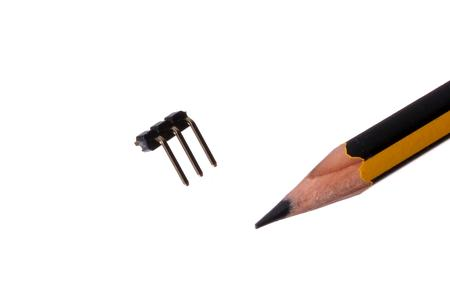

Contents
========

* [HEAD-I01-X-PI03-RA>2.54 mm 3 Pin Header Right Angle](#head-i01-x-pi03-ra254-mm-3-pin-header-right-angle)
	* [Images](#images)
	* [Images](#images)
	* [Tags](#tags)
  
![][im]
# HEAD-I01-X-PI03-RA>2.54 mm 3 Pin Header Right Angle

- ID: HEAD-I01-X-PI03-RA
- Name: HEAD-I01-X-PI03-RA

## Images
  
  

|Main|Reference|
| :---: | :---: |
|||

## Images
  
  

|Main|Reference|
| :---: | :---: |
|||

## Tags

- index: 8962
- hexID: H03R
- oompType: HEAD
- oompSize: I01
- oompColor: X
- oompDesc: PI03
- oompIndex: RA
- oompSort: HEADI0103PI
- ooPitch: 2.54
- ooPinHeight: 11.6
- ooPinWidth: 0.64
- ooPinOffset: 1.53
- ooNumPins: 3
- ooFootprint: OOMP-HEAD-I01-X-PI03-RA
- ooDesignator: J1
- manufacturer: {'', 'P125-1103A0BR138A1', 'C-YXCO', 'YXCON'}
- opl: {'', 'C-SEEE', '320020061', 'https://www.seeedstudio.com/opl.html', 'SEEED OPL', 'DIP Black Male Header R/A'}
- kicadSymbol: Connector:Conn_01x03_Male
- kicadFootprint: Connector_PinHeader_2.54mm:PinHeader_1x03_P2.54mm_Horizontal

[im]: image_600.jpg
