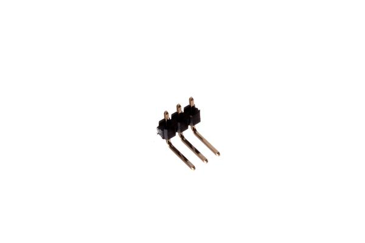

# HEAD-I01-X-PI03-RA > 2.54 mm 3 Pin Header Right Angle  
  
index : 8962  
hexID : H03R  
oompType : HEAD  
oompSize : I01  
oompColor : X  
oompDesc : PI03  
oompIndex : RA  
oompSort : HEADI0103PI  
ooPitch : 2.54  
ooPinHeight : 11.6  
ooPinWidth : 0.64  
ooPinOffset : 1.53  
ooNumPins : 3  
ooFootprint : OOMP-HEAD-I01-X-PI03-RA  
ooDesignator : J1  
manufacturer : {'', 'P125-1103A0BR138A1', 'YXCON', 'C-YXCO'}  
opl : {'', 'https://www.seeedstudio.com/opl.html', 'DIP Black Male Header R/A', 'C-SEEE', '320020061', 'SEEED OPL'}  
kicadSymbol : Connector:Conn_01x03_Male  
kicadFootprint : Connector_PinHeader_2.54mm:PinHeader_1x03_P2.54mm_Horizontal  
