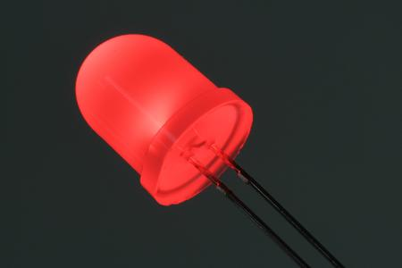
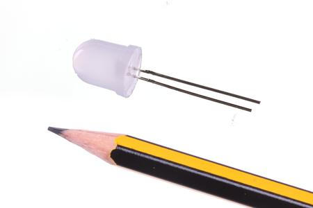

Contents
========

* [LEDS-10-R-FROS-01>10 mm Frosted Red LED](#leds-10-r-fros-0110-mm-frosted-red-led)
	* [Images](#images)
	* [Images](#images)
	* [Tags](#tags)
  
![][im]
# LEDS-10-R-FROS-01>10 mm Frosted Red LED

- ID: LEDS-10-R-FROS-01
- Name: LEDS-10-R-FROS-01

## Images
  
  

|Main|Reference|
| :---: | :---: |
|||

## Images
  
  

|Main|Reference|
| :---: | :---: |
|||

## Tags

- index: 9147
- oompType: LEDS
- oompSize: 10
- oompColor: R
- oompDesc: FROS
- oompIndex: 01
- hexID: L10R
- oompSort: 1010R
- ooPitch: 2.54 mm
- ooLensColor: Frosted
- ooForwardVoltage: >2.0 V
- ooForwardCurrent: 15 mA
- ooIntensity: 1,000 mcd
- ooPowerAngle: 50 deg
- ooWavelength: 623 nm
- ooDesignator: D1
- oompClass: Through Hole Component
- oompClassCode: THTH
- oompBbls: template;LEDS-10-X-XXXX-01-bbls
- oompDiag: template;LEDS-10-X-XXXX-01-diag
- oompIden: template;LEDS-10-X-XXXX-01-iden
- oompSchem: template;LEDS-XXXX-X-XXXX-XX-schem
- oompSimp: template;LEDS-10-X-XXXX-01-simp
- kicadSymbol: Device>LED
- kicadFootprint: LED_THT>LED_D10.0mm

[im]: image_600.jpg
