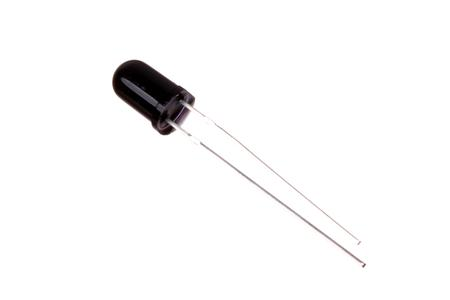
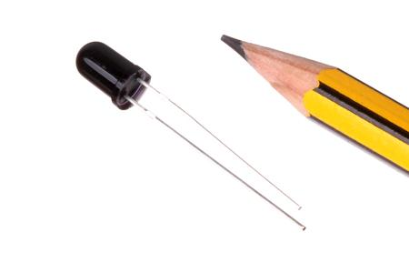

Contents
========

* [PHTR-05-I9-STAN-01>5 mm IR (940 nm) Phototransistor](#phtr-05-i9-stan-015-mm-ir-940-nm-phototransistor)
	* [Images](#images)
	* [Images](#images)
	* [Tags](#tags)
  
![][im]
# PHTR-05-I9-STAN-01>5 mm IR (940 nm) Phototransistor

- ID: PHTR-05-I9-STAN-01
- Name: PHTR-05-I9-STAN-01

## Images
  
  

|Main|Reference|
| :---: | :---: |
|||

## Images
  
  

|Main|Reference|
| :---: | :---: |
|||

## Tags

- index: 9183
- oompType: PHTR
- oompSize: 05
- oompColor: I9
- oompDesc: STAN
- oompIndex: 01
- hexID: PT5I9
- oompClass: Through Hole
- oompClassCode: THTH
- ooDesignator: Q1
- kicadSymbol: Device>R_Photo
- kicadFootprint: OptoDevice:R_LDR_10x8.5mm_P7.6mm_Vertical

[im]: image_600.jpg
