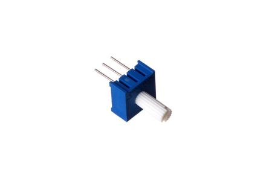
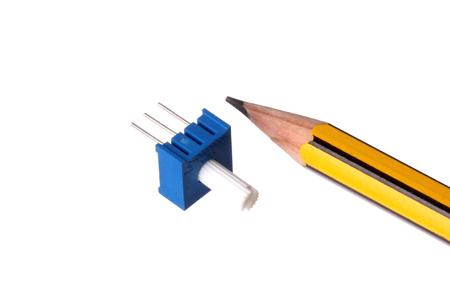
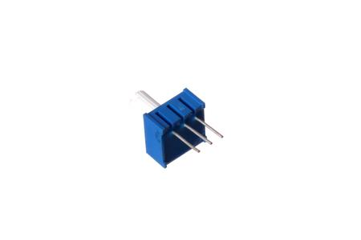

Contents
========

* [POTE-95D-L-O103-01>9.5 mm 10k Ohm Blue Potentiometer](#pote-95d-l-o103-0195-mm-10k-ohm-blue-potentiometer)
	* [Images](#images)
	* [Images](#images)
	* [Tags](#tags)
  
![][im]
# POTE-95D-L-O103-01>9.5 mm 10k Ohm Blue Potentiometer

- ID: POTE-95D-L-O103-01
- Name: POTE-95D-L-O103-01

## Images
  
  

|Main|Reference|Bottom|
| :---: | :---: | :---: |
||||

## Images
  
  

|Main|Reference|Bottom|
| :---: | :---: | :---: |
||||

## Tags

- index: 9187
- oompType: POTE
- oompSize: 95D
- oompColor: L
- oompDesc: O103
- oompIndex: 01
- hexID: PTA103
- oompClass: Through Hole Component
- oompClassCode: THTH
- ooDesignator: VR1
- kicadSymbol: Device>R_Potentiometer

[im]: image_600.jpg
