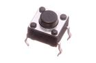
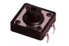
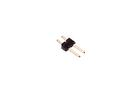
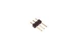
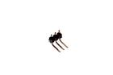
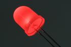
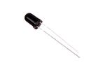
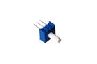
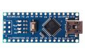
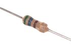

 [BUTA-06-X-STAN-01 > 6 mm Pushbutton (Tactile)](BUTA-06-X-STAN-01/Readme.md)  
 [BUTA-12-X-STAN-01 > 12 mm Pushbutton (Tactile)](BUTA-12-X-STAN-01/Readme.md)  
 [HEAD-I01-X-PI02-01 > 2.54 mm 2 Pin Header](HEAD-I01-X-PI02-01/Readme.md)  
 [HEAD-I01-X-PI03-01 > 2.54 mm 3 Pin Header](HEAD-I01-X-PI03-01/Readme.md)  
 [HEAD-I01-X-PI03-RA > 2.54 mm 3 Pin Header Right Angle](HEAD-I01-X-PI03-RA/Readme.md)  
 [LEDS-10-R-FROS-01 > 10 mm Frosted Red LED](LEDS-10-R-FROS-01/Readme.md)  
 [PHTR-05-I9-STAN-01 > 5 mm IR (940 nm) Phototransistor](PHTR-05-I9-STAN-01/Readme.md)  
 [POTE-95D-L-O103-01 > 9.5 mm 10k Ohm Blue Potentiometer](POTE-95D-L-O103-01/Readme.md)  
 [PROJ-ARDC-SHEN-STAN-01 > ](PROJ-ARDC-SHEN-STAN-01/Readme.md)  
 [RESE-W04-X-O561-01 > 1/4 Watt 560 Ohm Resistor](RESE-W04-X-O561-01/Readme.md)  
 [TRNN-T220-BCE-A05-01 > TO-220 5 Amp NPN Transistor](TRNN-T220-BCE-A05-01/Readme.md)  
